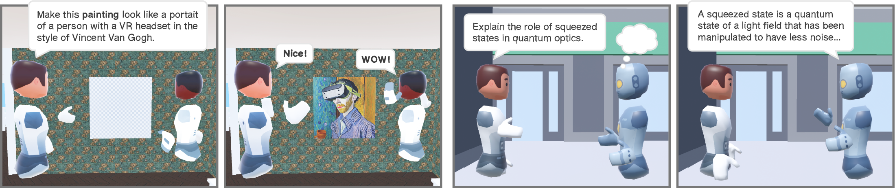

# Real-time Multi-User VR Platform using Ubiq-Genie



A real-time multiplayer VR communication platform built with [Unity](https://unity3d.com/get-unity/download) (version 2022.3.32f1 or later) and [Ubiq-Genie framework](https://github.com/UCL-VR/ubiq-genie), integrating low-latency speech transcription, spatial chat bubbles, and multimodal communication for collaborative VR environments.

This project was developed as part of an MEng Computer Science final-year project at University College London (UCL).

> [!NOTE]
> Ubiq-Genie is a framework that can build server-assisted collaborative mixed reality applications with Unity using the [Ubiq](https://ubiq.online) framework. For more information, please refer to the [Ubiq-Genie paper](https://ubiq.online/publication/ubiq-genie/), Ubiq's [documentation](https://ucl-vr.github.io/ubiq/) and [website](https://ubiq.online). Ubiq-Genie currently uses Ubiq [v1.0.0-pre7](https://github.com/UCL-VR/ubiq/releases/tag/unity-v1.0.0-pre.7).


---

## Overview

This project explores how multimodal communication (voice + live transcription) can improve communication clarity, engagement, and usability in shared VR environments.

The system combines:
- real-time voice communication,
- live speech transcription,
- spatial chat bubbles,
- peer-to-peer VR networking,
- low-latency speech pipelines.

The platform was implemented using Unity, Ubiq-Genie, [Whisper.cpp](https://github.com/ggml-org/whisper.cpp), and Azure Speech Services, and evaluated through a controlled VR user study involving 15 participants.

---

## Key Features

- Real-time multi-user VR communication
- Spatially synchronized chat bubbles
- Live speech-to-text transcription
- Whisper.cpp and Azure Speech integration
- Peer-to-peer networking architecture
- Multi-user avatar synchronization
- Low-latency communication pipelines
- Audio-only / Bubble-only / Combined communication modes
- Meta Quest 2 & Quest 3 support

---

## Demo

### VR Environment
<p align="center">

  <br>
  <em>Real-time multi-user VR environment with synchronized avatar interaction.</em>
</p>

<p align="center">

  <br>
  <em> Spatial chat-bubble interface with live speech transcription inside the VR environment.</em>
</p>


### Chat Bubble Communication
<p align="center">

  <br>
  <em> Multi-users Ubiq-genie Environment Capture in 1st Person view</em>
</p>

<p align="center">

  <br>
  <em> Multi-users Ubiq-genie Environment Capture in 3rd Person view.</em>
</p>


### Transcription Pipeline
The system processes live microphone audio and converts it into spatial chat bubbles inside the VR environment.

```text
Audio Input
   ↓
PushAudioInputStream
   ↓
Azure Speech SDK / Whisper.cpp
   ↓
Recognized Text Output
   ↓
Application Controller
   ↓
Network Broadcast
   ↓
Unity NetworkContext
   ↓
VR Chat Bubble Display
```
**Pipeline Summary**
1. Audio is captured from the VR client and streamed into the transcription service.
2. Azure Speech SDK or Whisper.cpp converts the audio stream into text.
3. The Node.js Application Controller captures the transcription output.
4. The text is broadcast through the Ubiq networking layer.
5. Unity receives the message and renders it as a spatial chat bubble attached to the speaker avatar.
---

## Performance Results

| Metric | Result |
|---|---|
| Transcription Latency Reduction | 11.7% |
| Word-level Accuracy | >96% |
| User Study Participants | 15 |
| Communication Modes Tested | 3 |

### User Study Findings

The combined multimodal condition (voice + chat bubbles) achieved the highest:
- engagement,
- communication effectiveness,
- usability,
- user preference.

---

## System Architecture

The platform adopts a modular peer-to-peer architecture inspired by Ubiq-Genie.

```text
VR Client (Unity)
        ↓
Audio Capture
        ↓
Ubiq-Genie Service Peer
        ↓
Speech Transcription
(Azure / Whisper.cpp)
        ↓
Node.js Controller
        ↓
Network Broadcast
        ↓
Spatial Chat Bubble Rendering
```

### Technologies

#### VR & Networking
- Unity
- Ubiq
- Ubiq-Genie
- Meta Quest 2 / Quest 3

#### Backend & Audio Processing
- Node.js
- Python
- C++
- Whisper.cpp
- Azure Speech SDK

#### Languages
- C#
- Python
- C++
- JavaScript

---

# Setup

## Initial Setup

Ubiq-Genie uses a server-client architecture.

### Server (Node.js)

0. Install:
- [Node.js](https://nodejs.org/en/download/) (v20+)
- [Python](https://www.python.org/downloads/) (v3.10+)

1. Clone repository

```bash
git clone https://github.com/MozhaoZhu/Real-time_multi-user_VR_platform.git
```

2. Open a terminal in the `Node` folder and run `npm install` to install the dependencies.

```bash
cd Node
npm install
```

3. Install the Python dependencies by navigating to the `Node/services` folder and running `pip install -r requirements.txt`. 

```bash
cd services
pip install -r requirements.txt
```
If you are using a virtual environment, activate it before running the command. Please ensure that you have the correct PyTorch and CUDA versions installed (see the [PyTorch website](https://pytorch.org/get-started/locally/) for more information).

---

### Client (Unity)

1. Install [Unity](https://unity3d.com/get-unity/download) 2022.3.32f1+

2. Open the Unity project

3. Navigate to Package Manager, click the Ubiq package (com.ucl.ubiq), navigate to the "Samples" tab, and import the "Demo (XRI)" sample. This will add the Unity XR Interaction Toolkit package to the project, as well as some scripts used by the Ubiq-Genie sample applications.

---

## Whisper.cpp Configuration

Example runtime configuration:

```bash
stream -m ggml-base.en.bin \
--step 2000 \
--length 5000 \
-t 8 \
--keep 400 \
-kc \
--stdin
```

---

## Repository Structure

```text
├── Unity/
├── Node/
│   ├── apps/
│   ├── services/
├── Documentation/
├── Assets/
└── README.md
```

---

## Research Context

This project investigates:
- multimodal communication in VR,
- low-latency transcription systems,
- accessibility in immersive environments,
- real-time distributed VR systems.

The work was evaluated using quantitative and qualitative user-study analysis across:
- Presence
- Effectiveness
- Usability
- Engagement

---

## Future Improvements

Potential future work includes:
- multilingual translation,
- speaker attribution,
- emotion-aware interaction,
- larger Whisper models,
- scalability improvements.

---

## References

- Ubiq Framework
- Ubiq-Genie
- Whisper.cpp
- Azure Speech Services

---

## Author

**Mozhao Zhu**  
MEng Computer Science — University College London (UCL)

GitHub: [Mozhao Zhu ](https://github.com/MozhaoZhu)
LinkedIn: [Mozhao Zhu](http://linkedin.com/in/mozhao-zhu-104a18229)
